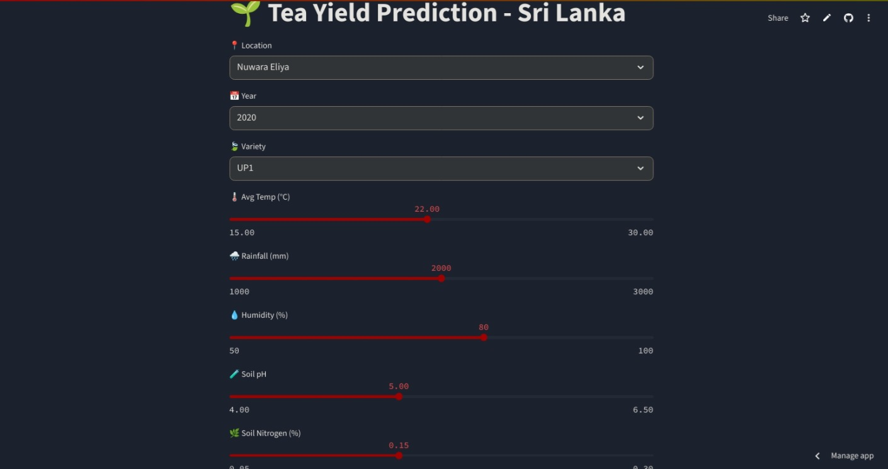
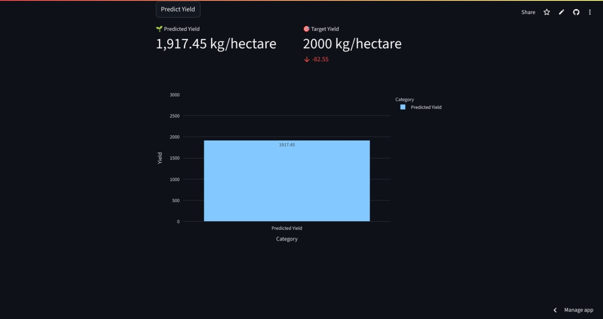

# Crop Yield Prediction 🌾

A machine learning-powered web app for predicting crop yields, built with Python and Streamlit. Instantly estimate the yield of your crops based on input features like rainfall, temperature, soil type, and more! 🚜✨

---

## 🚀 Features

- **User-Friendly Streamlit Interface**: Clean, interactive UI for data input and instant results.
- **Accurate Predictions**: Uses advanced ML models for reliable crop yield forecasts.
- **Visualizations**: See charts and graphs for your predictions and input data.
- **Easy to Deploy**: Run locally or deploy on Streamlit Cloud!

---

## 🟢 [](https://cropyieldprediction-nmsn2nzjjjqgagbxwt95br.streamlit.app/)

---

## 📦 Installation

1. **Clone the repository:**
   ```bash
   git clone https://github.com/nadee2k/crop_yield_prediction.git
   cd crop_yield_prediction
   ```

2. **Install dependencies:**
   ```bash
   pip install -r requirements.txt
   ```

---

## ▶️ Usage

Start the Streamlit app:

```bash
streamlit run app.py
```

The app will open in your default web browser.

---

## 🧑‍🌾 How to Use

1. **Input Features:**
   - Select crop type, soil type, region, etc.
   - Enter values for rainfall, temperature, fertilizer used, etc.

2. **Get Prediction:**
   - Click "Predict Yield".
   - View the estimated yield and visualizations.

3. **Export Results:**
   - Download results as CSV (if implemented).

---

## 🌟 Example

### App Screenshot




*Above: Example of the crop yield prediction interface and results.*

---

## 🛠️ Project Structure


```
crop_yield_prediction/
│
├── model/           # Trained ML models
├── data/            # Sample data files
├── .venv/           # Virtual environment (optional)
├── notebooks/       # Jupyter notebooks for experiments
├── app.py           # Streamlit application
├── requirements.txt # Python dependencies
├── README.md        # Project documentation
└── demo/            # Demo screenshots
```


---

## 🤝 Contributing

Pull requests and stars are welcome! For major changes, open an issue first to discuss your ideas.
---

## ✨ Acknowledgments

- [Streamlit](https://streamlit.io/)
- [Scikit-learn](https://scikit-learn.org/)
- Unsplash for images

---

> Built with ❤️ by [nadee2k](https://github.com/nadee2k)
